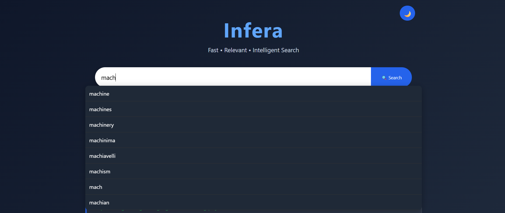

# 🔍 Infera – Intelligent Search Engine

Infera is a Python-based search engine that crawls web pages, builds an inverted index, ranks results using the TF-IDF algorithm, and serves search results through a modern Flask web interface.

It demonstrates the core concepts behind information retrieval systems such as web crawling, indexing, ranking, and query processing.

---

## 🚀 Features

- 🌐 Multi-domain web crawler
- 📑 Inverted Index generation
- 📊 TF-IDF based ranking
- 🔎 Intelligent keyword search
- 💡 Autocomplete search suggestions
- 📄 Dynamic search snippets
- 📚 Pagination
- 🌙 Dark / Light mode
- ⚡ Fast search using pre-built index
- 🎨 Responsive Flask interface

---

## 🛠 Tech Stack

**Backend**
- Python
- Flask

**Crawler**
- Requests
- BeautifulSoup

**Search Engine**
- Inverted Index
- TF-IDF Ranking
- BFS Crawling

**Frontend**
- HTML
- CSS
- JavaScript

---

## 📂 Project Structure

```
Infera/
│
├── app.py
├── crawler/
│   └── crawler.py
├── templates/
│   ├── index.html
│   └── results.html
├── static/
│   ├── css/
│   └── js/
├── data/
├── search_index.pkl
├── requirements.txt
└── README.md
```

---

## ⚙️ How It Works

### 1. Web Crawling
The crawler starts from predefined seed URLs and visits pages using Breadth-First Search (BFS).

### 2. Text Processing
The crawler:
- extracts page text
- removes punctuation
- converts to lowercase
- removes stop words
- tokenizes words

### 3. Inverted Index
Each word is mapped to every page containing that word.

Example:

```
python
 ├── page1
 ├── page7
 └── page25
```

### 4. Ranking

Each document is ranked using the TF-IDF algorithm.

Final ranking also considers:
- query match count
- title matches
- URL matches

### 5. Flask Interface

The Flask application loads the generated search index and returns ranked results almost instantly.

---

## 📸 Screenshots

### Home Page

> 

### Search Results

> 

### light Mode

> 

### search bar

> 

---

## ▶️ Installation

Clone the repository

```bash
git clone https://github.com/Gaargee/Infera.git
```

Move into the project

```bash
cd Infera
```

Create virtual environment

```bash
python -m venv venv
```

Activate environment

Windows

```bash
venv\Scripts\activate
```

Install dependencies

```bash
pip install -r requirements.txt
```

Run crawler

```bash
python crawler/crawler.py
```

Run Flask application

```bash
python app.py
```

Open

```
http://127.0.0.1:5000
```

---

## 📈 Future Improvements

- PageRank algorithm
- Phrase search
- Boolean search
- Image search
- Voice search
- Spell correction using edit distance
- Parallel crawling
- Larger search index
- Database-backed indexing

---

## 👩‍💻 Author

**Gaargee Sankhe**

Computer Engineering Student

Live Demo:
https://infera-lzgr.onrender.com

LinkedIn:
https://linkedin.com/in/gaargeesankhe

GitHub:
https://github.com/Gaargee

---

## ⭐ If you found this project interesting, consider giving it a star!